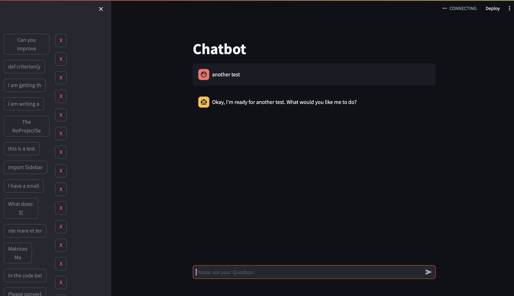

# ChatGPT Using Claude

A Simple ChatGPT like UI for working with AWS Bedrock. Includes the following features:

- ChatGPT like interface (although not as pretty)
- Persistent storage of conversation histories in a local folder
- Works with Anthropic's Claude, or any AWS Bedrock model

The container is dockerized and can be run on any machine with docker installed.

## Installation

To use, you will need an AWS account with SSO enabled. From here, created a
.env file with

```
AWS_PROFILE=your-profile-name
MODEL=anthropic.claude-3-sonnet-20240229-v1:0
```

Note that the container is configured to find your AWS credentials in
`~/.aws/config` file. Feel free to change the model to any other model
in AWS Becrock. You'll have to configure your account and sign the
EULA for the model you want to use.

Then you can run

```
docker-compose up
```

and navigate to `localhost:8505` to see the UI. Alternatively, you can
use VSCode's Dev Container extension to run the container. I have
included a devcontainer.json file for this purpose.

## Usage

History gets stored in the history folder. You can clear the history by deleting the contents of this folder or through the UI.

Here is a screenshot of the UI:


